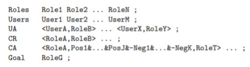

# ARBAC Analyser


```
Arapi Andi
12/09/20, Italy (Venice)
```
### Abstract
This document help us to understand how the ARBAC analyzer works. We have developed an
ARBAC analyser for small policies, the program parse the specification of a role reachability
problem and returns its solution. The project is developed in C ++, based on the application
of the algorithm with the addition of several components that allow us to expand the simple
initial structure making it expandable

### Introduction
The key idea of Role-Based Access Control (RBAC) can be summarized as follows:
1. Define a set of roles
2. Assign (sets of) roles to users, rather than individual permissions
3. Access rights only depend on assigned roles, not on user identities
4. Roles can be organized in a hierarchy

ARBAC is the administrative extension of RBAC which is used to handle role assignment and
role revocation. The most useful problem to solve for the security verification of ARBAC is
known as the role reach-ability problem, if the a given role find if is reachable. We have
the follow entities:
* Administrative Role: a role r if and only if it grants the ability to assign or revoke
some role.
* Can-Assign rules : express which roles can be assigned by owning r and under which
conditions.
* Can-Revoke rules: express which roles can be revoked by owning r and under which
conditions
The ARBAC standard has three components:
* URA: user-role administration, which deals with the common task of assigning and
revoking roles to users
* PRA: permission-role administration, which deals with the rare task of granting and
removing permissions to roles
* RRA: role-role administration, which deals with the uncommon task of changing the
role hierarchy

I will focus just on the URA component of ARBAC, hence we do not model permissions and
the role hierarchy

### Complexity of Role Reachability

The total number of possible user-to-role assignment is:

<p>
  
</p>


For example with roles R = 3 and users U = 30, we have 2^90 ≈ 1.23 × 1027 possibilities.


**Assumption**: Due to the temporal and spatial complexity the polices are very small

### Implementation

The library has been developed using C++ version 14. It is a CLion project, to use it is enough
open it with the IDE, and run it.


We have adopted the Model–view–controller (usually known as MVC) which is a software
design pattern commonly used for developing user interfaces that divides the related program

logic into three interconnected elements:
* Models: contains UR, CA, CR, Policy and Rule
* Controls: contains Utility, Parser and PolicyAnalyzer

Program must return 1 when the role reach-ability problem is solvable and 0 otherwise, as
Boolean parameter. The phase continues as it follows:
1. Parsing: read the policy and create the policy Object
2. Pruning Algorithm: simplify instances of role reach-ability
3. Policy Analyzer: search the possible solution respecting the configuration by brute force
and check the policy consistency

### How to Use
To start the system there is the necessity of introducing the follow elements:

* Policies in the policies directory with .arbac format
* Policy Path to parse in line 8 in main.cpp file

Program must return 1 when the role reachability problem is solvable and 0 otherwise

 

Program must parse a role reachability problem expressed via the syntax in Table above, for
the sake of simplicity, we do not show the trivial pre-condition, which is always satisfied,
represented as TRUE

### Results

In this section there are some experiments that are also reported in the main of the program,
in the table below we have reported the execution time, space complexity and reach-ability
result:

| |Time|Space| Result|
|-----|-----|-----|-----|
|Policy 1| 347,13 seconds | 39.327 KB  |REACHABLE|
|Policy 2| \> 1 day | \> 1 GB   | NOT REACHABLE|
|Policy 3|  0,434 seconds  | 11 KB |REACHABLE|
|Policy 4| 354,027 seconds  |39.359 KB   |REACHABLE|
|Policy 5|  \> 1 day | \> 1 GB | NOT REACHABLE|
|Policy 6|   342,251 seconds | 37.915 KB |REACHABLE|
|Policy 7|  \> 1 day | \> 1 GB  |NOT REACHABLE|


  


There is a trade off between reach-ability and spatial/temporal complexity due to the
algorithm search of the solution in all nodes of game tree. The not reachable Policy has a very
large complexity

### Conclusions

The spatial and temporal complexity are a big deal with this problem, we have the points
below to adopt:
* To reduce the spatial complexity we adopt map<> which is an efficient container
* To reduce the time complexity we need to study deeply this type problem and find good
heuristic to explore in intelligent way the game tree

### Future Work 

After a certain set time and space limit, the goal was achieved and we have reached this point.
In the future we can add other features to the library because they are out of our scope, for
example:
* Efficient Serialization of containers
* DFS search of possible configuration with check point
